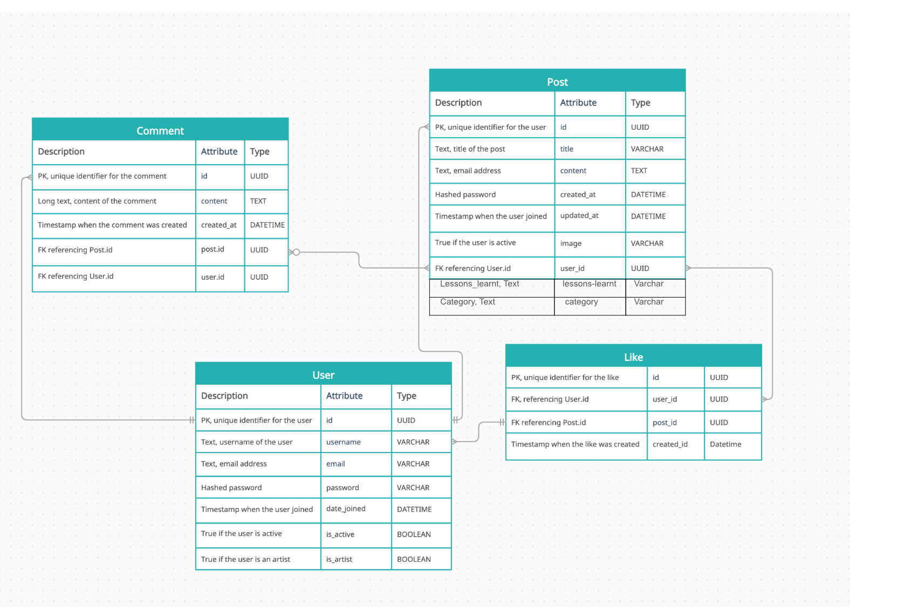
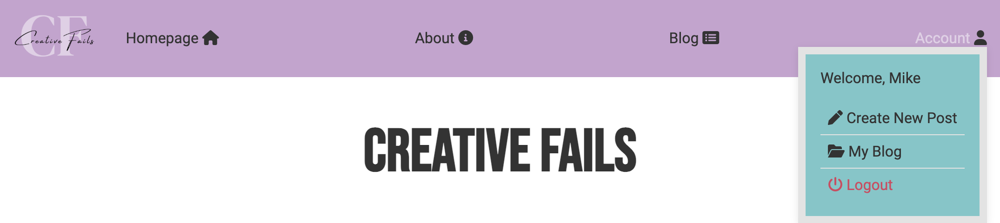
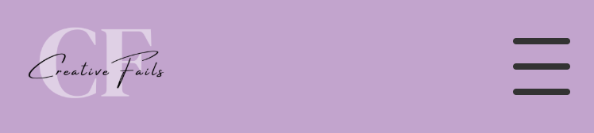
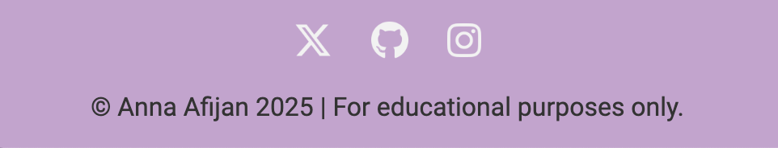
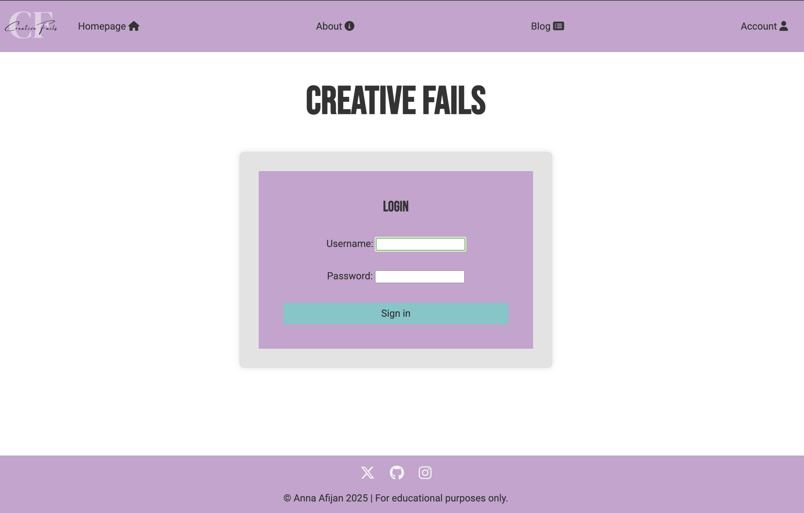

# CreativeFails

Welcome to Creative Fails! This is a platform where people can share their stories of creative projects that didn't go as planned. Whether it's a design mishap, a crafting disaster, or a failed artistic experiment, Creative Fails embraces the idea that mistakes are part of the creative journey. The community encourages learning from these experiences, sharing laughs, and finding inspiration in imperfection. It's a space where failure isn't the end—it's just another step toward creative growth.

Visit the deployed website here → [Creative-Fails](https://creativefails-b08c6c63e317.herokuapp.com/) 
The User Stories you can see here → [GitHub Project](https://github.com/users/Ann-Anahit/projects/1/views/1)

## Content

* [User Experience](#user-experience-ux)
    * [Site Objectives](#site-objectives)
    * [User Stories](#user-stories)
* [Design](#design)
    * [Website Structure](#website-structure)
    * [Wireframes](#wireframes)
    * [Color Scheme](#color-scheme)
    * [Typography](#typography)
* [Features and Future Features](#features-and-future-features)
    * [Features](#features)
    * [Future Features](#future-features)
* [Technologies Used](#technologies-used)
* [Testing](#testing)
* [Bugs](#bugs)
    * [Known Bugs](#known-bugs)
    * [Fixed Bugs](#fixed-bugs)
* [Deployment, Fork and Clone](#deployment-fork-and-clone)
    * [Deployment](#deployment)
    * [Fork](#how-to-fork)
    * [Clone](#how-to-clone)
* [Credits](#credits)
* [Content](#content)
* [Media](#media)
* [Acknowledgments](#acknowledgments)

## User Experience (UX)

### Site Objectives

CreativeFails is a dynamic platform designed for artists to embrace and learn from their creative missteps. Our mission is to foster a supportive community where artists can share their failures openly, exchange valuable feedback, and gain insights to enhance their craft. By transforming setbacks into opportunities for growth, CreativeFails aims to cultivate resilience and innovation in the artistic journey. Join us in celebrating the imperfect and turning artistic challenges into stepping stones for success.

### User Stories

#### First Time User

* I want to share my Experiences.
* I want to edit/delete my posts.
* I want to receive and give Feedback.
* I want to comment and like the other posts.
* I want to signe up and sign in.
* I want responsiveness from my website.
* I want to sign out.

#### Returning User

* I want to edit my posts.
* I want to edit my comments.
* I want to delete the comments of other users under my post.
* I want to be able to dislike the other posts.
 

#### Frequent User

* I want to keep my profile and project gallery fresh, update it.
* I want to use my expertise to mentor newer members and offer constructive feedback.

[Back to top](<#content>)

## Design

### Website Structure

My plan was to support artists at all levels. The Home Page welcomes users and highlights featured projects. User Dashboard provides access to current user posts. Share your work lets you upload and showcase projects.
This website consists of a home page, an about page, a blog page, a user blog page, a create new post page, a login page, a registration page.

These additional features will be introduced soon.

Explore: search function, and success stories.
Resources: Articles, workshops, and tools.
Challenges & Collaboration: Current challenges and group projects.
Events: Upcoming activities.
Community: Member directories and groups.
Help & Support: FAQs and contact information.
Blog: Updates on news and guest posts.
Privacy Policy & Terms of Service: Ensure transparency and user rights.

### Wireframes

Balsamiq was the software I opted to create the wireframes. I created wireframes from the homepage for mobile and desktop.

  
Home page 

[Back to top](<#content>)

### Color Scheme

This website has two main colors, `#C2A4CD` being the primary was used for the the navigation bar and details. The color `#87c5c8` was used for the buttons. This secondary color `#ebb573`is used to make hover effects for the buttons. This color `#721c24` is used for hover from delete buttons.This colors `#d4edda` & `#dfd4e3` are used for the background from post cards. 
For background I used often this color as white color`#e3e3e3`. As font color I used this color `#333333`.  
For success messages I used this two colors: `#155724` and `#d4edda`. For negative messages these two colors: `#721c24` and `#dfd4e3`.

[Back to top](<#content>)

### Entity Relationship Diagram

The ERD is pretty simple.
Entities and Relationships:
1. User:
Attributes: id, username, email, password, date_joined, is_active and is_artist
A User can create many Posts.
A User can like many Posts (many-to-many).
A User can comment on many Posts.

2. Post:
Attributes: id, title, content, created_at, updated_at, image, user_id (foreign key to User)
A Post belongs to a User.
A Post can have many Likes (many-to-many with User).
A Post can have many Comments.

3. Like:
Through table connecting User and Post (many-to-many relationship).
Attributes: id, user_id, post_id, created_at
A Like belongs to both a User and a Post.

4. Comment:
Attributes: id, content, created_at, post_id (foreign key to Post), user_id (foreign key to User)
A Comment belongs to a User.
A Comment belongs to a Post. (many-to-many with User).

[Back to top](<#content>)

### Typography

The fonts I chose to use were [Roboto](https://fonts.google.com/specimen/Roboto) and [Bebas-Neue] (https://fonts.google.com/specimen/Bebas+Neue?query=bebas+neue) from Google Fonts and as a fall back font, sans-serif.

[Back to top](<#content>)

## Features and Future Features

### Features

This is a multi-page website and all of them are responsive. On each page we have:

- A favicon. 

- A navigation bar with clickable logo will take the user to the home page and the menu with sign up button highlighted to facilitate the user experience. There is a top bar on top of the navigation bar with the login navigation source.

- A footer with social media icons that lead to external pages and to my github page in case you click my name.

[Back to top](<#content>)

### The Home Page

 The Home Page is displayed initially, featuring three most commented posts and pagination buttons. The logged out user can't interact with posts and can only see the homepage with posts. 
 If a user is registered as an artist, they can create and share their own posts, comment on other posts, and like all posts. On the other hand, if the user is not registered as an artist, they can only read all posts, comment on them, and like them, but they cannot create or share their own posts.

[Back to top](<#content>)

### The About Page

The About Page is displayed initially, featuring a welcome text and navigation options. 

### The Blog page

In the blog page there are displayed all posts from all users after 12 posts there are paginations.

[Back to top](<#content>)

### The My Blog page

In the My blog page there are displayed all posts from the current User after 8 posts there are paginations.

### Sign In Page
Clicking the "Sign In" link takes users to the Sign-In Page, and after signing in, they are redirected to the Posts Page to view and interact with posts.
A page where the user can log in to their account.

[Back to top](<#content>)

### Sign Up Page

The user can sign up here if he wants to create own posts, he must sign up as an artist.

[Back to top](<#content>)

### Write Article Page

This page will take you to the login page in case you are not logged in, but in case you are, you are redirected to the write article page if you are registered as an artist. 
If the user doesn't add category there won't be written 

[Back to top](<#content>)

### Future Features

- I would like to have: 
- Explore: A gallery, search function, and success stories.
- Resources: Articles, workshops, and tools.
- Challenges & Collaboration: Current challenges and group projects.
- Events: Upcoming activities.
- Community: Member directories and groups.
- Help & Support: FAQs and contact information.
- Blog: Updates on news and guest posts.
-Privacy Policy & Terms of Service: Ensure transparency and user rights.

[Back to top](<#content>)

## Technologies Used

- HTML5 to create the website structure.
- CSS3 to style the website.
- JavaScript to create the interactions on the website.
- [Python](https://www.python.org/) + [Django](https://www.djangoproject.com/) to create the fullstack project.
- [Git](https://git-scm.com/) for version control.
- [GitPod](https://www.gitpod.io/) as IDE to create the website.
- [GitHub](https://github.com/) to store files for the website.
- [Figma](https://www.figma.com/) to create the wireframes.
- [Chat GPT](https://chat.openai.com/) to generate fictional texts.
- [Google Fonts](https://fonts.google.com/) to import the font used on the website.
- [Favico](https://favicon.io/favicon-converter/) to create favicon.
- [Logo](https://www.canva.com/) to create Logo.
- [Am I Responsive?](https://ui.dev/amiresponsive) to display the website image across various devices.
- [Appetize.io](https://appetize.io/) to simulate the iOS environment.
- [PostgreSQL](https://www.postgresql.org/) through Code Institute databases.
- [Python Tutor](https://pythontutor.com/) to debug my code.
- [Python Validator](https://pep8ci.herokuapp.com/#) by Code Institute to catch some errors and validate my code.
- [Lucidchart](https://www.lucidchart.com/) to create the flowcharts.
- [Heroku](https://www.heroku.com/) to deploy this project.
- [Cloudinary](https://cloudinary.com/) to store the images uploaded on the website.

[Back to top](<#content>)

## Deployment, Fork and Clone

### Deployment

The application has been deployed from GitHub to Heroku by following the steps:

1. Create or log in to your account at [Heroku](https://www.heroku.com/).
2. Create a new app, add a unique app name and then choose your region.
3. Click on Create App.
4. Go to "Settings".
5. Under Config Vars add a key "PORT" and value "8000".
6. Add required buildpacks (further dependencies). For this project, set it up so Python will be on top and Node.js on bottom.
7. Go to "Deploy" and select "GitHub" in "Deployment method".
8. To connect Heroku app to your Github repository code enter your repository name, click "Search" and then "Search" when it shows below.
9. Choose the branch you want to build your app from.
10. If preferred, click on "Enable Automatic Deploys", which keeps the app up to date with your GitHub repository.
11. Wait for the app to build. Once ready you will see the “App was successfully deployed” message and a "View" button to take you to your deployed link.

[Back to top](<#contents>)

### How to Fork

1. Log in to GitHub.
2. Go to the repository for the project.
3. Click the Fork button in the top right corner.

### How to Clone

1. Log in to GitHub.
2. Go to the repository for the project.
3. Click on the **green code button** and select if you would like to clone with HTTPS, SSH or GitHub CLI and copy the link below.
4. Navigate to the directory where you want to clone the repository and open terminal.
5. Type *git clone* into the terminal and paste the link you have from number 3. Press enter. This command will download the entire repository to your local machine.

[Back to top](<#content>)

## Testing

Performed tests can be found in [TESTING.md](TESTING.md).

[Back to top](<#content>)

## Bugs
no bugs

### Fixed Bugs

- A few days after submitting the project, the link didn't open, so I managed to correct this error.

[Back to top](<#content>)

## Credits

- The most of the features of my website were developed with the guidance of the lessons from the Code Institute's I Think Therefore I Blog project.
- [Django's documentation](https://docs.djangoproject.com/en/5.0/) has become my best friend alongside [W3Schools](https://www.w3schools.com/).

## Acknowledgments

I would like to acknowledge:
- Kay Welfare - My cohort facilitator who's always there for us.
- Tristan and my sister Seda for supporting me.

[Back to top](<#content>)