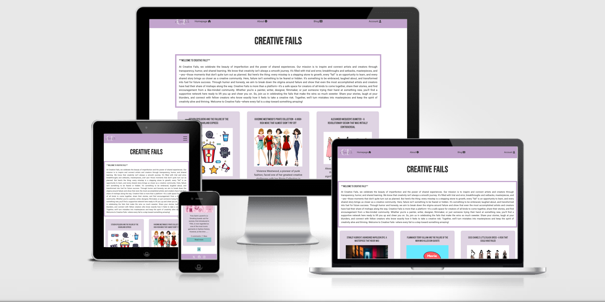
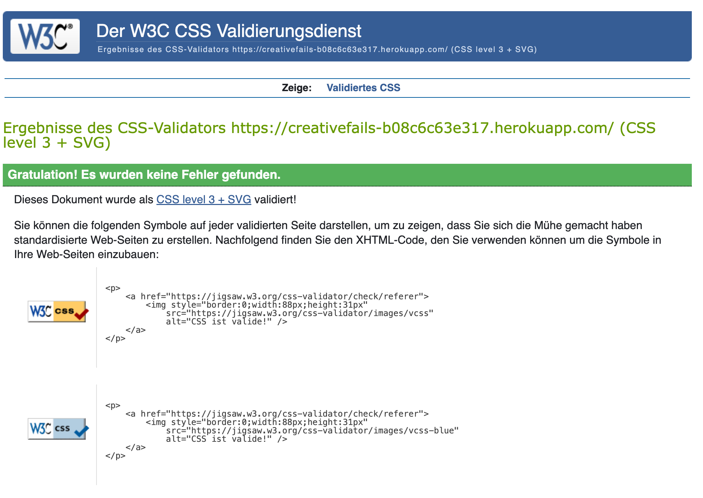
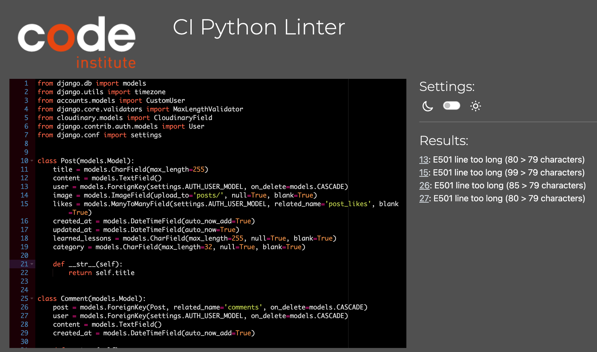

# Creative Fails Website - Testing

Visit the deployed website here → [Creative Fails](https://creativefails-b08c6c63e317.herokuapp.com/)

## Content

- [Testing User Stories](#testing-user-stories)
- [Manual Testing](#manual-testing)
  - [Browser Testing](#browser-testing)
- [Validators](#manual-testing)
  - [HTML Validator](#html-validator)
  - [CSS Validator](#css-validator)
  - [JavaScript Validator](#javascript-validator)
  - [Python Validation](#python-validation)
  - [Lighthouse](#lighthouse)

## Testing User Stories

- First time visitors

| Expectation                                              | Result                                                                                                                                        |
| :------------------------------------------------------- | :-------------------------------------------------------------------------------------------------------------------------------------------- |
I want to Signe up and Sign in. | I can sign up and sign in without any difficulty.
I want the option to sign up as an artist to create my own blog posts.                       | I can register as an artist and create my own posts.     
I want to share my experiences and read about other projects.                                    |  I can quickly access and explore valuable information. |
|I want to Receive and Give Feedback.                                        | I can comment on posts to share or receive feedback.   | I want responsiveness from my website.                   | 	I experience full responsiveness, ensuring a seamless experience on all  devices.              |
|I want to Connect with the Community.          | The User can comment the other posts 
 
- Returning Visitors

| Expectation                                          | Result                                                                                  |
| :--------------------------------------------------- | :-------------------------------------------------------------------------------------- |
| I want to edit my posts | The user can edit and delete the own posts.
| I want to Explore New art Projects.                | The user can see the posts and read them.              |
| I want to create new posts.                  | The user can create new posts.                     
I want to edit and delete my own posts | The user can edit and delete the own posts.
I want to delete any comment from my posts | The user can delete also the comments from other users. | 
I want to deslike some posts            | The user can dislike the posts  

[Back to top](#content)

## Manual Testing

| Feature                                                                     | Expectation                                                                   | Action                                                        | Result |
| --------------------------------------------------------------------------- | ----------------------------------------------------------------------------- | ------------------------------------------------------------- | ------ |
| Logo                                                                   | If you click on the Logo, the homepage is supposed to open     | Click the arrows                                              | Passed |
| Navbar buttons                                                              | Take the user to the respective section                                       | Click buttons                                                 | Passed |
| Create new post                                                           | Go to the write article page. If user not signed in, ask to sign in                 | Click on the button                                           | Passed |
| Top bar                                                                     | Change the menu when a user signs in/out                                      | Sign in/out                                                   | Passed |
| Write article Page                                                               | You can write an  article and the date and time of your post will be printed also the author. You can add an image, a write a category and write what you have learnt from that creative failure, which you post.                                                 |write article page                                         | Passed | 
| write article and create                        |If you don't add a text in category or learnt lesson field, on the post page won't be that fields  | write article and create |Passed
Logout                                                                      | Signs out of the account                                                      | Click the button                                              | Passed |
| Account creation                                                            | Create account as an artist and as non artist                                                               | Fill out the form                                             | Passed |
| User knows they're signed in                                                | Display a welcome message  on the screen after sign in                                 | Look at the screen                                            | Passed |
| Empty, false or wrong values                                                | Forms don't allow empty or false values                                       | Try to submit a form with empty inputs, wrong characters, etc | Passed |
| Footer links open externally                                                | Footer links open externally                                                  | Click on the links in the footer                              | Passed |
| Success messages                                                             | User get sucess messages after submit any form (login, signup, booking, etc) and after any action| Submit a form                                                 | Passed |

 

### Browser Testing

I tested the website in different browsers, both on computer and mobile. iOS tests were made on [Appetize.io](https://appetize.io/).

| Browser         | Result                     |
| :-------------- | :------------------------- |
| Google Chrome   | The website is responsive. |
| Microsoft Edge  | The website is responsive. |
| Mozilla Firefox | The website is responsive. |
| Opera           | The website is responsive. |

[Back to top](#content)

## Validators Testing

### HTML Validator

[W3C](https://validator.w3.org/) checked the HTML of the website. There are some error messages because of .

### CSS Validator

The CSS was validated by [W3C Jigsaw](https://jigsaw.w3.org/css-validator/) and passed the test. To see the full result, click on the name below.

### Python Validation

[PEP8 Validation](https://pep8ci.herokuapp.com/) found some issues and I fixed them all. Only couple of lines are too long.

### Lighthouse

I used [PageSpeed Insights](https://pagespeed.web.dev/) to test the full performance of the website.  

- Mobile

[Home](documentation/images/home_m.png) 

[About](documentation/images/about_m.png) 

[Blog](documentation/images/posts_m.png) 

[My Blog](documentation/images/my-post_m.png) 

[Sign in](documentation/images/signin_m.png) 

[Registration](documentation/images/registration_m.png) 

[Write article](documentation/images/write_article_m.png)  

- Desktop

[Home](documentation/images/home_d.png) 

[About](documentation/images/about_d.png) 

[Blog ](documentation/images/blog_d.png) 

[My Blog ](documentation/images/my-post_d.png) 

[Sign in](documentation/images/signin_d.png) 

[Registration](documentation/images/register_d.png) 

[Write article](documentation/images/write_article_d.png)  

[Back to top](#content)